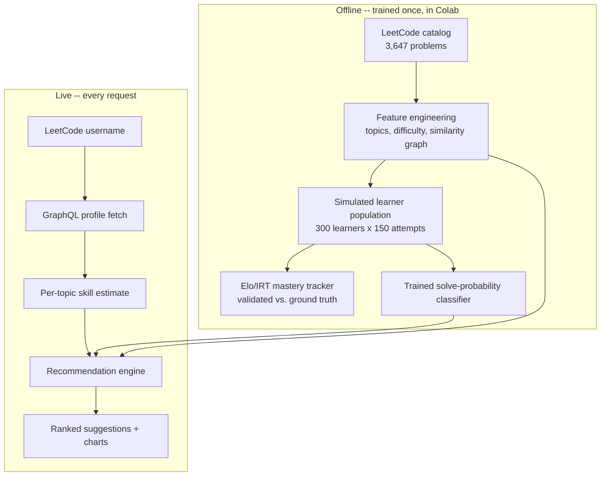
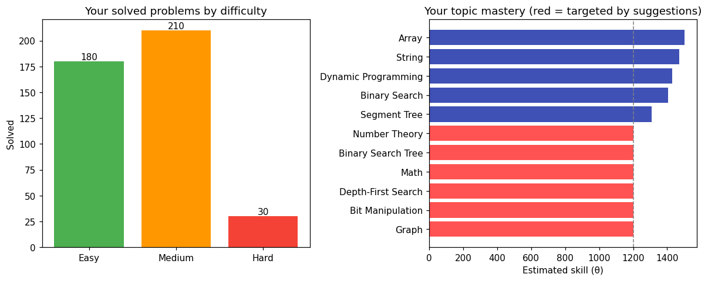

<div align="center">

# 🧭 LeetCoach AI

**Machine learning-based personalized coding practice recommendation system**

Most coding platforms track *how many* problems you've solved. LeetCoach AI estimates *what you actually know*, topic by topic, and recommends what to solve next to close the biggest gaps — instead of more of what you're already good at.

[](https://www.python.org/)
[](https://streamlit.io/)
[](LICENSE)
[](https://github.com/al-shovon/leetcoach-ai/commits/main)
[](#) 
<!-- ^ replace the # above with your actual .streamlit.app URL once deployed -->

**[Try the live demo →](#)**

</div>

---

## Table of Contents

- [The Problem](#the-problem)
- [How It Works](#how-it-works)
- [Validated Results](#validated-results)
- [Full Methodology](#full-methodology-click-to-expand)
- [Example Output](#example-output)
- [Project Structure](#project-structure)
- [Getting Started](#getting-started)
- [Security & Privacy](#security--privacy)
- [Limitations](#limitations)
- [Roadmap](#roadmap)
- [Author](#author)

---

## The Problem

Many LeetCode users solve problems randomly. That grows the total-solved count, but it doesn't guarantee balanced coverage across topics or a real beginner-to-advanced progression — people over-practice what's already comfortable and skip the topics they're actually weak in. LeetCoach AI pulls a user's **real, live LeetCode profile** and recommends the next problems most likely to close their specific gaps, at a difficulty that stretches without discouraging.

## How It Works



1. **Live profile pull** — enter a public LeetCode username; the app fetches real solve history via LeetCode's GraphQL endpoint (no login required).
2. **Per-topic mastery estimate** — tag-level solve counts convert into a skill estimate (θ) per DSA topic, on the same logistic scale used by Elo/chess ratings.
3. **Problem difficulty rating (β)** — every problem in the ~3,600-problem catalog is rated from its difficulty tier and a selection-bias-adjusted acceptance rate.
4. **Recommendation** — a classifier trained on a simulated learner population predicts solve probability on every unsolved problem; the app surfaces ones in the "desirable difficulty" zone (55–80% predicted success), weighted toward topics not yet practiced.

## Validated Results

| Metric | Result |
|---|---|
| Problem catalog | 3,647 problems (3,237 in DSA scope) |
| Similar-problem graph | 5,116 links, 100% resolved internally, fully symmetric |
| Simulated training data | 300 learners × 150 attempts = 45,000 interaction records |
| Mastery tracker accuracy | 0.62 correlation vs. simulated ground truth — climbing from 0.44 (3–5 attempts) to 0.74 (11+ attempts) |
| Trained classifier | AUC 0.71, beating the 0.68 AUC of the hand-built closed-form formula |

Every number above came from an end-to-end run with no manual steps beyond uploading the catalog CSV — see [Full Methodology](#full-methodology-click-to-expand) below for how each one was derived.

## Full Methodology (click to expand)

<details>
<summary>Why not collaborative filtering, how difficulty is rated, and how mastery is tracked</summary>

### Why not collaborative filtering?
The training data is a catalog of problems — pure item metadata (difficulty, topics, acceptance rate). There's no user × item interaction matrix, so classic collaborative filtering ("users who solved X also solved Y") has nothing to factor. This is framed instead as a **knowledge-tracing** problem: estimate one learner's latent per-topic skill from their solve history against items of known difficulty.

### Difficulty rating (β)
Raw acceptance rate understates how hard "Hard" problems really are — acceptance rate is computed only among people who *attempt* a problem, and Hard problems are disproportionately attempted by strong solvers (selection bias). β blends the human-assigned difficulty tier with the within-tier acceptance signal rather than relying on either alone.

### Mastery tracking (θ)
An Elo-style rating per topic — the same math behind chess/Codeforces ratings. Two refinements over vanilla Elo:
- **Inverse-frequency credit splitting** — a problem tagged with 3 topics doesn't cleanly reveal which one the solver leaned on, so credit for the outcome is split across topics weighted by rarity (a niche tag is more diagnostic than "Array," which appears on ~60% of problems).
- **K-factor with a floor, not pure decay** — standard Elo decays K assuming the true rating is fixed; here learners are actively improving, so K needs a floor to keep tracking a moving target instead of freezing early.

### Validation approach
Since no public multi-user LeetCode interaction dataset exists, a population of 300 synthetic learners was simulated under the same IRT-style probability model, each with evolving true skill. The tracker's estimates are checked against that *known* ground truth — a clean, honest way to validate a knowledge-tracing model without needing real multi-user data.

</details>

## Example Output

<div align="center">


<em>Illustrative example (placeholder data) — swap this for a real screenshot of your own deployed app once it's live.</em>
</div>

## Project Structure

```
leetcoach-ai/
├── app.py                          # Streamlit app (deployed entry point)
├── requirements.txt
├── artifacts/                      # pre-trained model + problem features
│   ├── problems.json
│   ├── solve_classifier.pkl
│   └── config.pkl
├── assets/
│   └── example-output.png
├── .gitignore
├── LICENSE
└── README.md
```

## Getting Started

```bash
git clone https://github.com/al-shovon/leetcoach-ai.git
cd leetcoach-ai
python3 -m venv venv && source venv/bin/activate   # Windows: venv\Scripts\activate
pip install -r requirements.txt
streamlit run app.py
```

## Security & Privacy

- **No API keys or credentials anywhere in this project** — the LeetCode profile fetch uses their public, unauthenticated GraphQL endpoint.
- **Stateless by design** — usernames looked up through the app are never logged, stored, or persisted; each request fetches, scores, and returns.
- `.gitignore` excludes `.streamlit/secrets.toml`, `.env*`, and common credential file patterns up front, so if this project ever grows a feature that *does* need a key, it won't accidentally end up in the repo history.

## Limitations

- LeetCode doesn't publicly expose full submission history without login, so recommendations use tag-level solved counts plus the last ~20 submissions — not a complete history.
- The unofficial GraphQL endpoint can change its schema without notice.
- The mastery model is validated against a *simulated* learner population (see [Full Methodology](#full-methodology-click-to-expand)), not real multi-user data, since no public dataset like that exists for this task.

## Roadmap

- [ ] Swap the logistic regression for a gradient-boosted ranker (LightGBM) on the same features
- [ ] Resolve a fuller solved-problem set beyond the last ~20 submissions
- [ ] Spaced-repetition-style resurfacing for topics not practiced recently

## Author

**Shovon** — Final-year BSc Software Engineering (Data Science), Daffodil International University

[LinkedIn](https://www.linkedin.com/in/shoovoon/) · [GitHub](https://github.com/al-shovon)

---

<div align="center">
<sub>If this was useful or interesting, a ⭐ on the repo is appreciated.</sub>
</div>
